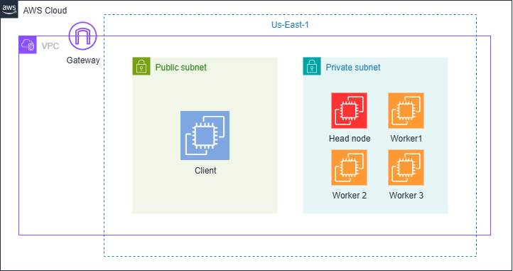

# Comparación de Infraestructuras Paralelas y Distribuidas en ML con Ray

## Intención del Proyecto
Este proyecto busca comparar el rendimiento y eficiencia de infraestructuras de cómputo paralelas y distribuidas en problemas de machine learning, específicamente en la optimización de hiperparámetros de modelos. Se utiliza el framework Ray para implementar y evaluar búsquedas de hiperparámetros tanto de forma secuencial como paralela/distribuida, permitiendo analizar ventajas y desventajas de cada enfoque.

## Estructura de Archivos

```
Api/
  app.py                # API Flask principal
  Data.py               # Carga y preparación de datos
  SequencialSearch.py   # Búsqueda secuencial de hiperparámetros
  peticion.py           # Ejemplo de petición a la API
  Dockerfile            # Configuración para contenerización
  Ray/
    ParalelDisSearch.py # Búsqueda paralela/distribuida con Ray
Client/                 # Frontend (React + Vite)
  src/
    App.jsx            # Componente principal de la aplicación
    components/
      NeuralNetworkForm.jsx  # Formulario para entrenamiento y predicción
Scripts/
  headinit.bash        # Script de inicialización para nodo principal
  rayinit.sh          # Script de configuración de Ray
  workerinit.bash     # Script de inicialización para nodos worker
docker-compose.yml    # Configuración de servicios Docker
AwsDeployment.md     # Guía de despliegue en AWS
```

## Instrucciones de Uso

### Backend (API)

1. **Instalación Local**:
   ```bash
   cd Api
   pip install -r requirements.txt
   pip install ray  # Instalación separada para compatibilidad
   ```

2. **Iniciar la API**:
   ```bash
   python app.py
   ```

### Frontend (Cliente React)

1. **Instalación**:
   ```bash
   cd Client
   npm install
   ```

2. **Iniciar aplicación en modo desarrollo**:
   ```bash
   npm run dev
   ```

## API Endpoints

### POST /sequential-search
Realiza búsqueda secuencial de hiperparámetros y predicción.

### POST /parallel-search
Realiza búsqueda paralela de hiperparámetros usando Ray.

**Ejemplo de payload para ambos endpoints:**
```json
{
  "param_grid": {
    "hidden_layer_sizes": [[5], [10]],
    "activation": ["relu"],
    "solver": ["adam"],
    "alpha": [0.001],
    "max_iter": [50]
  },
  "age": 25,
  "gender": 1,
  "education": 3,
  "country": 2,
  "ethnicity": 1,
  "nscore": 0.5,
  "escore": 0.3,
  "oscore": 0.2,
  "ascore": 0.1,
  "cscore": 0.4,
  "impulsive": 0.6,
  "ss": 0.7
}
```

**Ejemplo de respuesta:**
```json
{
  "best_params": { ... },
  "best_score": 0.85,
  "search_time": 12.34,
  "prediction": 1
}
```

## Despliegue

### Docker Compose (Desarrollo)
Para levantar todo el stack de desarrollo:
```bash
docker-compose up
```

### Docker (Solo API)
Para ejecutar solo la API:
```bash
docker run -p 5000:5000 bayronj/rayapi
```

### AWS



Para instrucciones detalladas sobre el despliegue en AWS, consulta el archivo `AwsDeployment.md`.

## Scripts de Despliegue

El directorio `Scripts/` contiene los scripts necesarios para configurar un cluster distribuido:

- `headinit.bash`: Configura el nodo principal
- `rayinit.sh`: Inicializa Ray
- `workerinit.bash`: Configura los nodos worker

Para más detalles sobre la configuración distribuida, consulta `AwsDeployment.md`.


